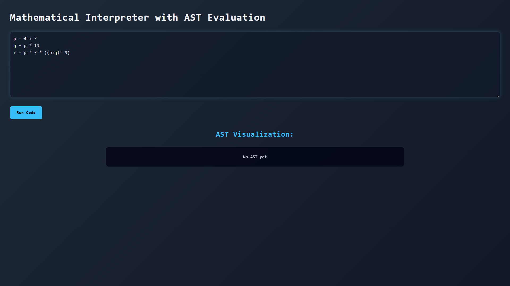
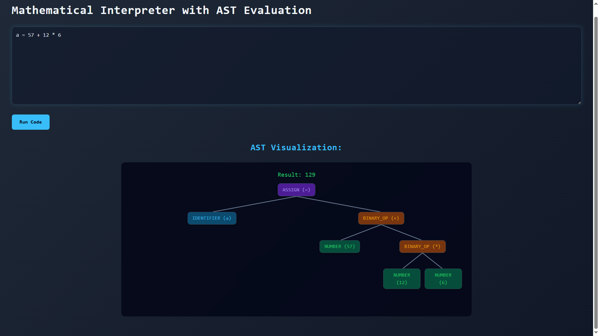
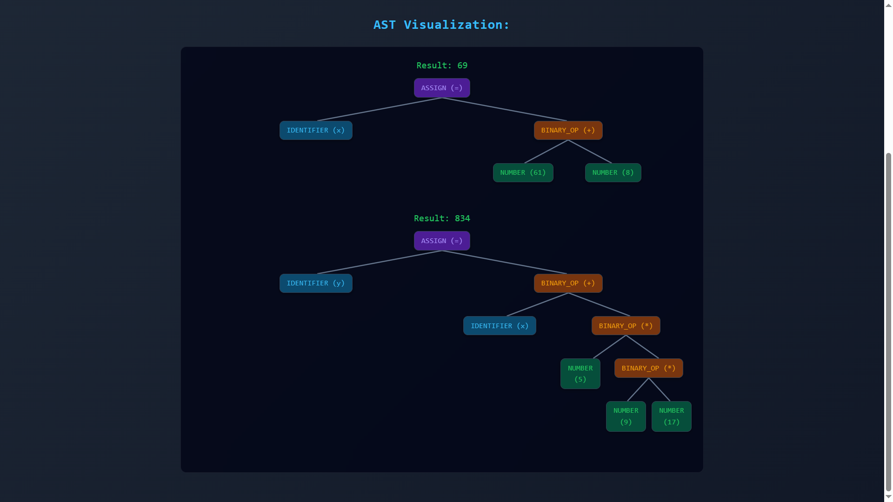
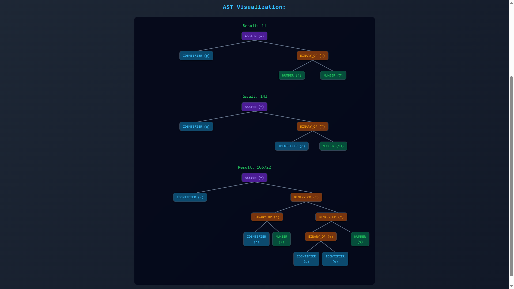
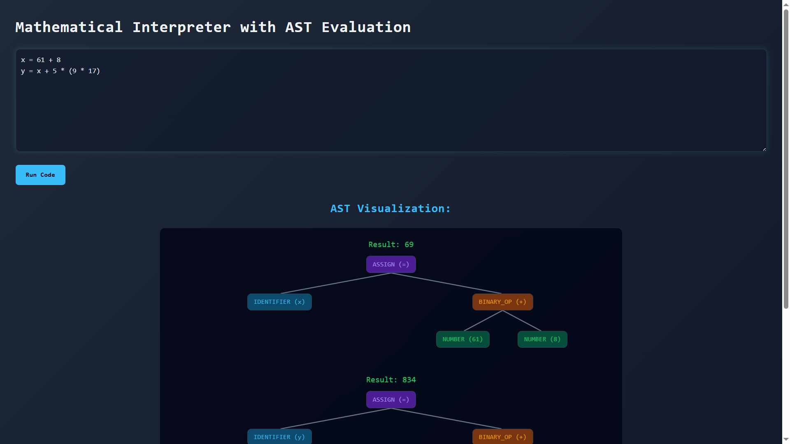
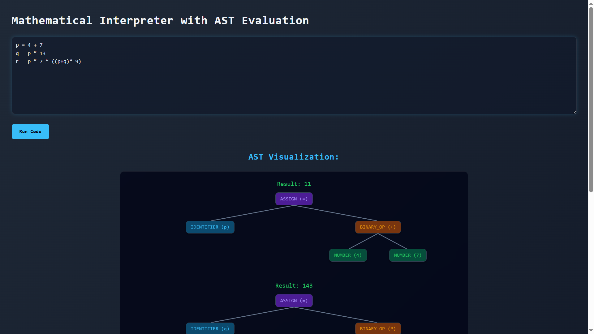
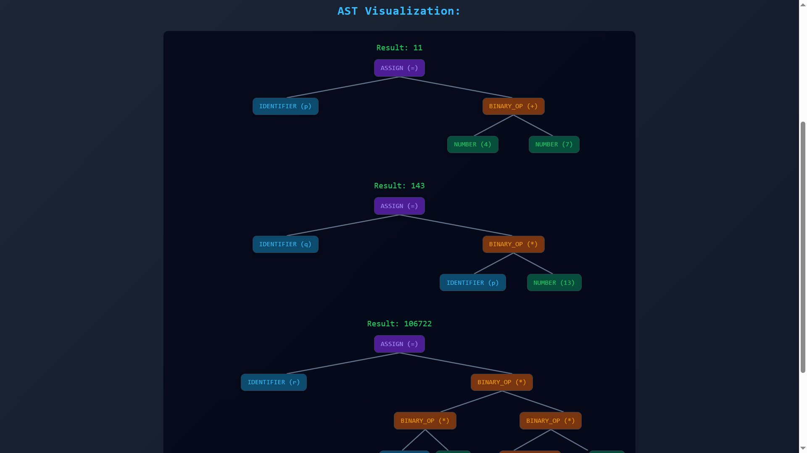
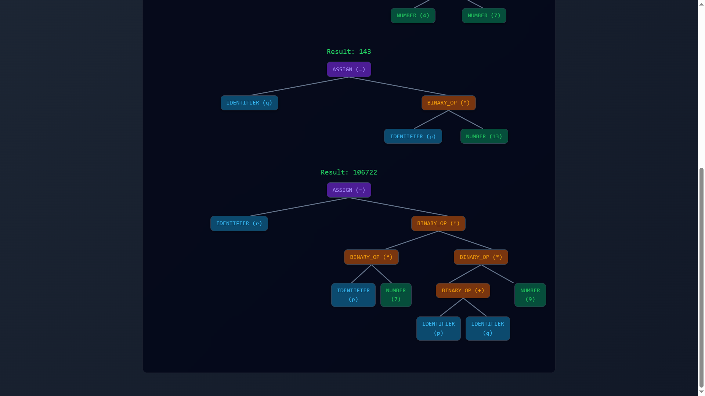

# 🚀 AST-Based Expression Interpreter with Interactive Visualization

A full-stack project that demonstrates core **compiler design concepts** by building a custom interpreter in C++ and visualizing its **Abstract Syntax Tree (AST)** in a modern web UI.

This project showcases a **complete end-to-end execution pipeline**—from parsing raw input to generating structured AST and evaluating results—highlighting strong fundamentals in **systems design** and **problem-solving**.
It also demonstrates the ability to **bridge low-level C++ logic with a modern frontend**, delivering an **interactive developer tool** rather than a simple academic implementation.

---

## 🛠️ Tech Stack

### 🔹 Backend (Compiler Core)

* C++
* Lexer (Tokenization)
* Recursive Descent Parser
* AST Construction
* Expression Evaluator

### 🔹 Frontend

* Next.js (App Router)
* TypeScript
* CSS / Tailwind
* SVG-based Tree Rendering

---

## 📸 Demo / Screenshots

### 🔹 Input & Execution

<p align="center">
  <a href="./compiler/Screenshot/InputSingleLine.png">
    
  </a>
  <a href="./compiler/Screenshot/InputMultipleLine1.png">
    
  </a>
  <a href="./compiler/Screenshot/InputMultipleLine2.png">
    
  </a>
</p>

---

### 🔹 AST Visualization

<p align="center">
  <a href="./compiler/Screenshot/OutputSingleLine.png">
    
  </a>
  <a href="./compiler/Screenshot/OutputMultipleLine12.png">
    
  </a>
  <a href="./compiler/Screenshot/OutputMultipleLine24.png">
    
  </a>
</p>

---

### 🔹 Multiple Statements

<p align="center">
  <a href="./compiler/Screenshot/InputSingleLine.png">
    
  </a>
  <a href="./compiler/Screenshot/InputMultipleLine1.png">
    
  </a>
  <a href="./compiler/Screenshot/InputMultipleLine2.png">
    
  </a>
  <a href="./compiler/Screenshot/OutputSingleLine.png">
    
  </a>
  <a href="./compiler/Screenshot/OutputMultipleLine11.png">
    
  </a>
  <a href="./compiler/Screenshot/OutputMultipleLine12.png">
    
  </a>
  <a href="./compiler/Screenshot/OutputMultipleLine21.png">
    
  </a>
  <a href="./compiler/Screenshot/OutputMultipleLine22.png">
    
  </a>
  <a href="./compiler/Screenshot/OutputMultipleLine23.png">
    
  </a>
  <a href="./compiler/Screenshot/OutputMultipleLine24.png">
    
  </a>
</p>

---

## ✨ Features

* 🧠 Custom **Lexer (Tokenizer)**
* 🌳 Recursive Descent **Parser**
* 🧩 AST (Abstract Syntax Tree) generation
* ⚡ Expression evaluation engine
* 🔄 Supports **multiple statements**
* 📊 Interactive **AST visualization**
* 🎨 Color-coded nodes for better understanding
* 🌐 Full-stack integration using Next.js

---

## 📂 Project Structure

```
compiler/
├── lexer.cpp / lexer.h
├── parser.cpp / parser.h
├── evaluator.cpp / evaluator.h
├── ast.h
├── main.cpp

compiler-ui/
├── app/
│   ├── page.tsx
│   ├── layout.tsx
│   ├── globals.css
│   ├── favicon.ico
│   └── api/run/route.js
├── compiler.exe   ← (generated and copied here)
```

---

## ⚙️ How It Works

1. User enters expressions:

   ```
   a = 5 + 3
   b = a * 2
   ```

2. Backend (C++):

   * Tokenizes input
   * Parses into AST
   * Evaluates expressions
   * Converts AST → JSON

3. Frontend (Next.js):

   * Sends input to API
   * Receives AST + results
   * Renders tree visually

---

## ▶️ Run Locally

### 1️⃣ Compile C++ Backend

```bash
cd compiler
g++ main.cpp lexer.cpp parser.cpp evaluator.cpp -o compiler
```

---

### 2️⃣ Move Executable to Frontend

```bash
copy compiler.exe ../compiler-ui/
```

(For Linux/Mac)

```bash
mv compiler ../compiler-ui/
```

---

### 3️⃣ Run Next.js Frontend

```bash
cd compiler-ui
npm install
npm run dev
```

---

### 4️⃣ Open in Browser

```
http://localhost:3000
```

---

## 🧠 Key Concepts Demonstrated

* Lexical Analysis
* Parsing (Recursive Descent)
* Abstract Syntax Tree (AST)
* Expression Evaluation
* Full-stack Integration
* Tree Visualization

---

## ⚠️ Limitations

* Flex-based tree layout (not algorithmic)
* Deep expressions may not align perfectly
* Limited error handling

---

## 👨‍💻 Author

**Rahul Sharma**

---

## ⭐ If you like this project

Give it a star ⭐ on GitHub — it helps others discover it!
